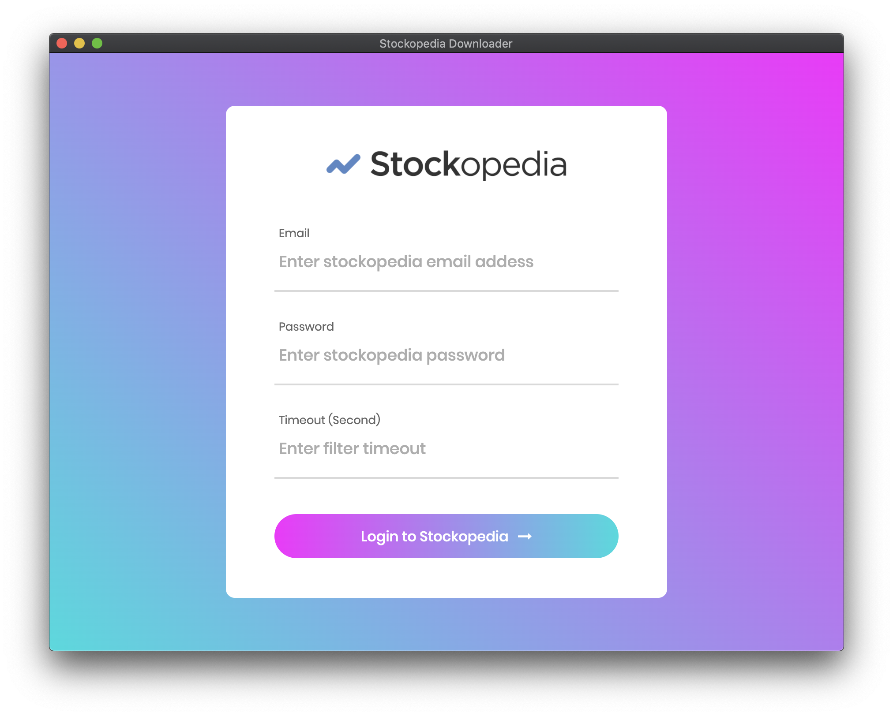

# Stockopedia-Data-Downloader-Saul-PPH

This will download all the screen files and save to an excel from stockopedia.com



### Open terminal & navigate to project directory then run the main.py from venv

```
venv/bin/python main.py
```
